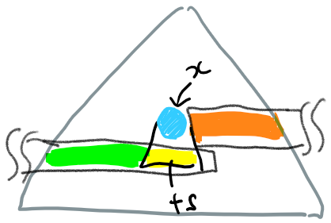

# RoseTreeに幅優先順で番号を付ける

Rose treeは枝の数が任意の木。

```haskell
data Tree a = Node a [Tree a]
```

ラベルに番号を付加する操作を考える。

```haskell
:: Tree a -> Tree (Int,a)
```

深さ優先順の場合、部分木に番号付けした結果を集めて現在のノードを完成させることができ、素直な構造になる。

```haskell
dfsid :: Tree a -> Tree (Int, a)
dfsid = snd . recur 0
  where
    recur :: Int -> Tree a -> (Int, Tree (Int, a))
    recur k (Node x ts) = fmap (Node (k, x)) $ mapAccumL recur (succ k) ts
```

幅優先探索の場合、子ノードに番号付けするのはその場では行われず、幅優先走査のキューに投入するだけになるため、現在のノードに番号付けした子をつなぐことが簡単にはできない。

ここで、（結果として求めたい）番号付けされた木の全ての部分木について、幅優先順に並べたリストを考える。幅優先走査のキューを消化していく反復関数は木を左上から右下に辿り、キューが空になると、この番号付けされた部分木を順に一つずつ構築して戻ってくる。

現在の反復において注目しているノード（部分木の根）の子は、このリストの少し先にある。実際には、引数で渡されたキューの長さだけ先にある。なぜなら、子はキューのその位置に投入されるからである。

下図で、水色のノードを処理しているとき、キューには既に弟たち（橙色）、兄たちの子（緑色）が投入されていて、自分の子ts（黄色）はその後に並ぶ。反復呼び出しから戻ってきたとき、返り値は、弟たち以降の木がある。そのうちほしいのは、黄色の範囲の木である。



```haskell
import qualified Data.Sequence as Q

bfsid :: Tree a -> Tree (Int,a)
bfsid = head . iter 0 . Q.singleton
  where
    iter _ Q.Empty = []
    iter k (Node x ts Q.:<| tqueue) = n1 : tias
      where
        n1 = Node (k,x) $ take (length ts) $ drop (Q.length tqueue) tias
        tias = iter (succ k) (tqueue Q.>< Q.fromList ts)
```

